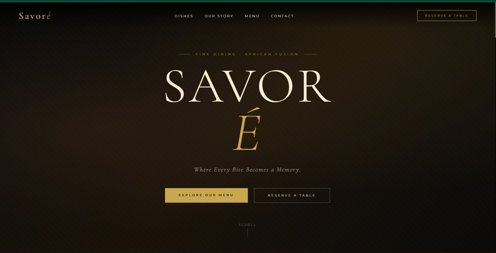
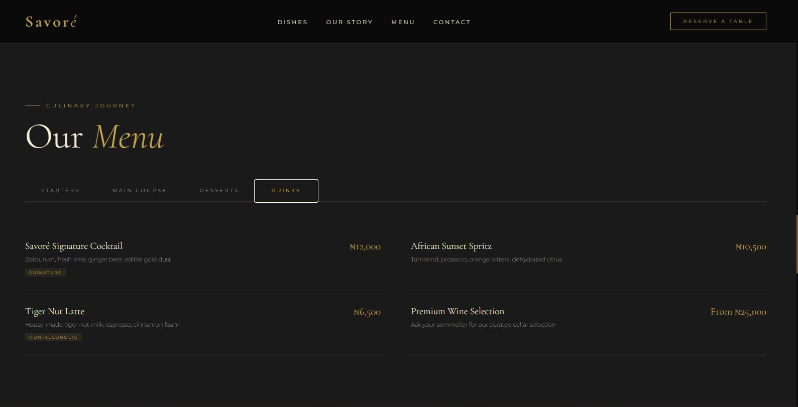
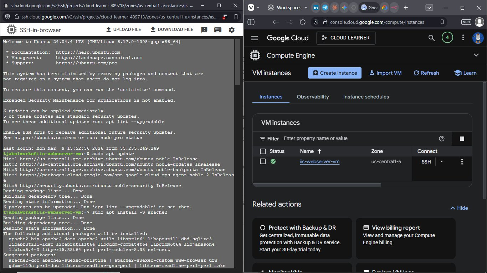
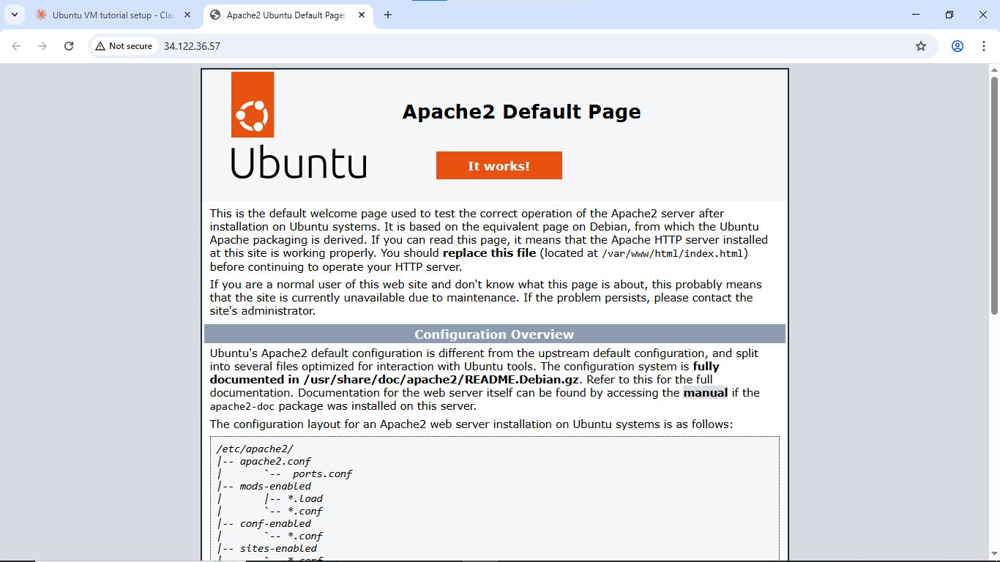

<div align="center">

# 🍽️ Savoré Restaurant Website

### *Where Every Bite Becomes a Memory.*

[](http://tj.ddns.net)
[](https://github.com/TJ-Abel/savore-restaurant-website)
[](https://docs.google.com/document/d/1WgXn0Shxc3-0mpp6HGNboIaLZOhoTuCL/edit?usp=sharing&ouid=103227920438659480697&rtpof=true&sd=true)

A **full-stack cloud deployment project** — from zero to a live luxury restaurant website hosted on **Google Cloud Platform**, built and deployed entirely from scratch in a single session.

</div>

---

## 🖼️ Project Screenshots

<table>
  <tr>
    <td align="center" width="50%">
      
      <br/><sub><b>Hero Landing Page</b></sub>
    </td>
    <td align="center" width="50%">
      
      <br/><sub><b>Interactive Menu</b></sub>
    </td>
  </tr>
  <tr>
    <td align="center" width="50%">
      
      <br/><sub><b>GCP Console + SSH Terminal Setup</b></sub>
    </td>
    <td align="center" width="50%">
      
      <br/><sub><b>Apache2 Server Verified Working</b></sub>
    </td>
  </tr>
</table>

---

## 🌐 Live Demo

> 👉 **[http://tj.ddns.net](http://tj.ddns.net)**

The site is live and publicly accessible, hosted on a real Ubuntu server on Google Cloud Platform.

---

## 📄 Full Technical Documentation

A complete write-up of this entire project — every command, every decision, and future plans — is available here:

> 📘 **[Read the Full Documentation](https://docs.google.com/document/d/1WgXn0Shxc3-0mpp6HGNboIaLZOhoTuCL/edit?usp=sharing&ouid=103227920438659480697&rtpof=true&sd=true)**

---

## 🎯 What This Project Is

This is not just a website — it is a **complete cloud deployment project** that demonstrates the full journey from provisioning a cloud server to serving a live, public-facing web application.

**The stack:**
- ☁️ **Cloud VM** provisioned on Google Cloud Platform (free tier)
- 🐧 **Ubuntu 24.04 LTS** as the server operating system
- 🌐 **Apache2** as the web server
- 🎨 **Pure HTML / CSS / JavaScript** for the frontend
- 🔗 **No-IP DNS** for the custom domain name

---

## 🛠️ How I Built This — Step by Step

### 1. Provisioned the Cloud VM
Created a free-tier **e2-micro** virtual machine on Google Cloud Compute Engine, running Ubuntu 24.04 LTS in the `us-central1-a` zone.

### 2. Connected via SSH
Used Google Cloud's browser-based SSH to connect to the VM directly from the console.

### 3. Installed & Configured Apache2
```bash
# Update package lists
sudo apt update

# Install Apache web server
sudo apt install -y apache2

# Start Apache immediately
sudo systemctl start apache2

# Enable Apache to auto-start on every reboot
sudo systemctl enable apache2

# Verify it's running
sudo systemctl status apache2
```

### 4. Installed nano Text Editor
```bash
# Ubuntu minimal image doesn't include nano by default
sudo apt install -y nano
```

### 5. Deployed the Website
```bash
# Navigate to Apache's web root
cd /var/www/html

# Open the default page for editing
sudo nano index.html
# (Replaced default Apache page with the Savoré website)
```

### 6. Configured the Firewall
In Google Cloud Console:
- Navigated to **VM → Edit → Firewalls**
- Enabled ✅ **Allow HTTP traffic** (port 80)

### 7. Set Up a Custom Domain
- Registered a free hostname at **No-IP** (`tj.ddns.net`)
- Created an **A Record** pointing to the VM's external IP: `34.122.36.57`
- Website became accessible at `http://tj.ddns.net`

---

## ✨ Website Features

| Feature | Details |
|--------|---------|
| 🎨 Design | Luxury dark theme — Deep Gold `#C9A84C` + Matte Black `#0a0a0a` |
| 🔤 Typography | Cormorant Garamond (display) + Montserrat (body) |
| 📱 Responsive | Fully mobile and desktop optimised |
| 🍽️ Menu | Interactive tabbed menu — Starters, Mains, Desserts, Drinks |
| 📅 Reservations | Full booking form with date, time, guest count, and special requests |
| 🎬 Animations | Scroll-reveal animations using IntersectionObserver API |
| 🔝 Navigation | Sticky navbar with scroll-based background transition |
| 📍 Contact | Location, phone, email, and opening hours |

---

## 🗂️ Project Structure

```
savore-restaurant-website/
│
├── index.html          # Complete single-file website (HTML + CSS + JS)
├── screenshots/        # Project screenshots
│   ├── hero.png        # Landing page hero section
│   ├── menu.png        # Interactive menu section
│   ├── server.png      # GCP + SSH terminal
│   └── apache.png      # Apache2 default page (proof of server)
└── README.md           # This file
```

---

## 💡 What I Learned

This project touched multiple domains simultaneously:

- **Linux Administration** — navigating the file system, managing services, installing packages, editing files in the terminal via SSH
- **Cloud Computing** — provisioning and managing a VM on Google Cloud Platform
- **Web Server Configuration** — installing, starting, enabling, and verifying Apache2
- **Networking & DNS** — configuring firewall rules, understanding IP addresses, setting up A records
- **Frontend Development** — building a complete, animated, responsive website from scratch with pure HTML/CSS/JS
- **UI/UX Design** — luxury brand identity with cohesive palette, typography hierarchy, and smooth interactions
- **Domain Management** — connecting a public domain to a cloud-hosted server
- **Problem Solving** — diagnosing real errors (missing packages, wrong domain type, SSH timeouts) and resolving them

---

## 🚀 What I Will Do Next

Here's my roadmap for making this project even better:

- [ ] **Add real food photography** — replace the emoji placeholders with professional dish images to dramatically elevate the visual quality
- [ ] **Connect a real email to the reservation form** — using [Formspree](https://formspree.io) so reservations actually land in an inbox
- [ ] **Integrate n8n for automation** — use [n8n](https://n8n.io) to automate reservation workflows, booking confirmations, order processing, and notifications
- [ ] **Set up HTTPS / SSL** 🔒 — install a Let's Encrypt certificate via Certbot so the site shows the secure padlock and builds trust
- [ ] **Get a paid domain** — register `savore.com` or `savore.ng` for a fully professional brand presence

---

## 🧰 Tech Stack


---

## 📊 Server Info

| Property | Value |
|----------|-------|
| Cloud Provider | Google Cloud Platform |
| VM Name | iis-webserver-vm |
| Machine Type | e2-micro (free tier) |
| OS | Ubuntu 24.04.4 LTS |
| Zone | us-central1-a |
| Web Server | Apache2 v2.4.58 |
| External IP | 34.122.36.57 |
| Domain | tj.ddns.net |

---

## 🎨 Brand Identity — Savoré

> **Cuisine:** Contemporary African Fusion with global influences
>
> **Tagline:** *Where Every Bite Becomes a Memory.*
>
> **Colors:** Deep Gold · Matte Black · Warm Earth Tones
>
> **Feel:** Elegant · Luxurious · Memorable · Authentic

---

<div align="center">

**Built with ❤️ by [TJ-Abel](https://github.com/TJ-Abel) — March 2026**

*From zero to a live cloud server in one session.*

</div>
